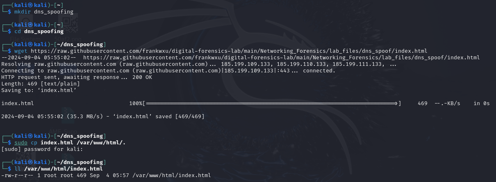
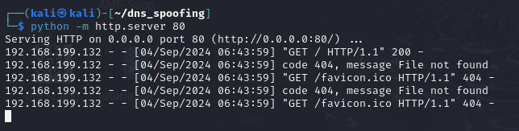
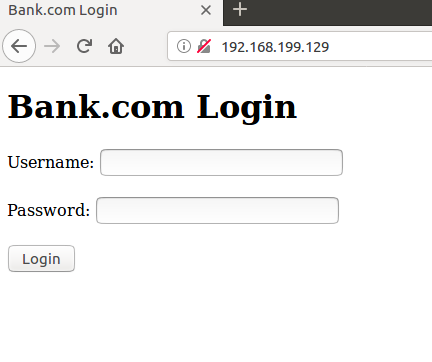
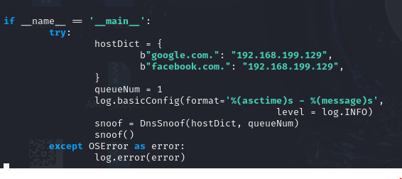
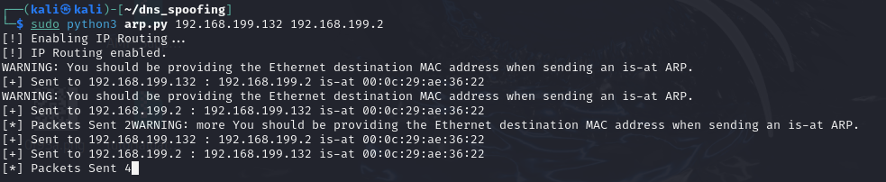
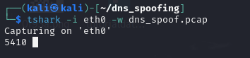
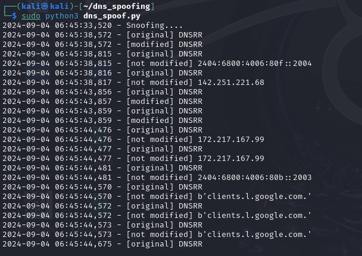
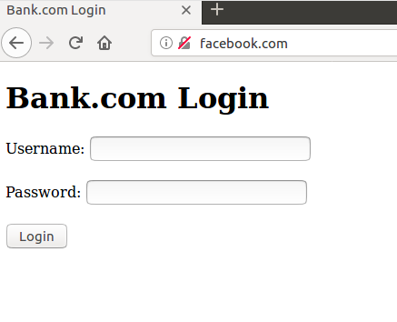

## DNS Spoofing Simulation
This project simulates a DNS spoofing attack in a controlled environment.  

### Overview
DNS spoofing is an attack where an attacker tricks a system into storing fake DNS information. This allows the attacker to redirect users to fake websites that look real, potentially stealing personal data or causing further damage to the system.  

### Disclaimer
**This project is intended for educational and research purposes only. It should not be used on any network or system without explicit permission. Unauthorized use of these techniques may be illegal and is strictly prohibited.**  

### Requirements
- Isolated environment (2 Virtual Machines): I used the SEED Labs Ubuntu 16.04 VM as the victim machine and the Kali Linux VM as the attacker machine.
- Fake website hosted on the attacker machine.  
- ARP Poisoning Program used to intercept the network traffic.
- DNS Poisoning Program to spoof DNS and redirect traffic.
- Wireshark (Optional): I used it to analyse the attack and capture network traffic.

### Steps
1. First, I created a new directory for DNS spoofing, but you can skip this step and directly download the fake website resources using:  
   `wget https://raw.githubusercontent.com/frankwxu/digital-forensics-lab/main/Networking_Forensics/lab_files/dns_spoof/index.html`  
   Next, I put **index.html** in **/var/www/html/.**. This is a simple website that cannot send data to the attacker’s server.  
     
2. Start the Python Simple HTTP server for the website and set the port to 80.  
   
3. Verify if the victim machine can access the website using the attacker's IP address.  
   
4. Next, prepare the ARP poisoning and DNS spoofing scripts.  
   **ARP Poisoning Script**: `wget https://raw.githubusercontent.com/frankwxu/digital-forensics-lab/main/Networking_Forensics/lab_files/dns_spoof/arp.py`  
   **DNS Spoofing Script**: `wget https://raw.githubusercontent.com/frankwxu/digital-forensics-lab/main/Networking_Forensics/lab_files/dns_spoof/dns_spoof.py`  
     
5. Open the **dns_spoof.py** script you downloaded and update the IP address in the hostDict variable to match the attacker’s IP address.  
   You can open it using any text editor, but I used nano in this example `sudo nano dns_spoof.py`.  
   
6. Run the ARP Poisoning script and provide the victim address and the gateway address. In this example, the victim address is **192.168.199.132** and the gateway address is **192.168.199.2**.  
   
7. Then, I turned on Wireshark to capture all the network traffic for analysis.  
     
8. Run the DNS Spoofing script in another terminal tab on the attacker machine.  
     
9. On the victim machine, navigate to **facebook.com**. The victim will be redirected to the fake website we set up earlier.  
     
10. When I used the DNS Lookup feature in Firefox and entered **google.com** as the domain. It revealed the attacker’s IP address.  
     

The data captured by Wireshark will be analysed using Splunk, as detailed in the <a href="https://github.com/elvanalandi/Home-Cybersecurity-Lab/tree/main/Splunk/DNS%20Spoofing%20Analysis">Splunk DNS Analysis</a>.  
